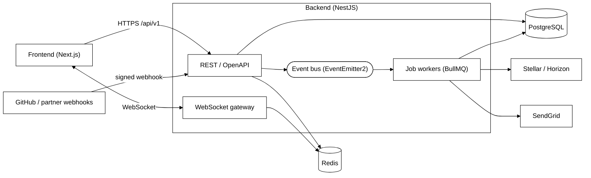
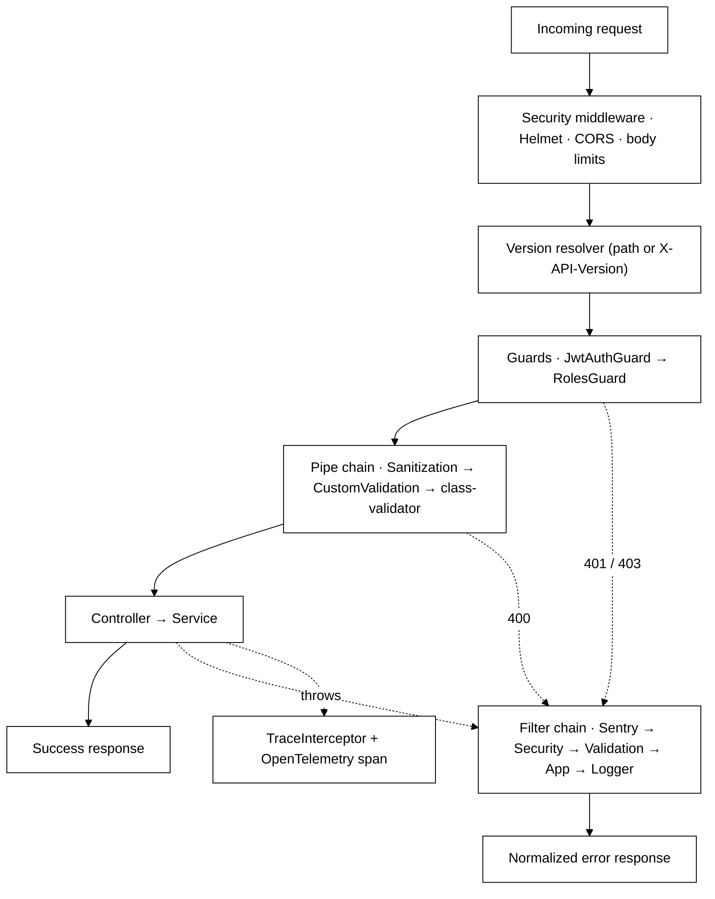
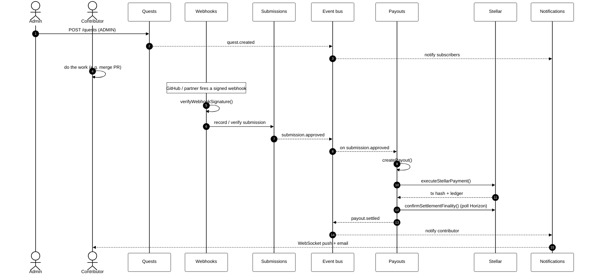
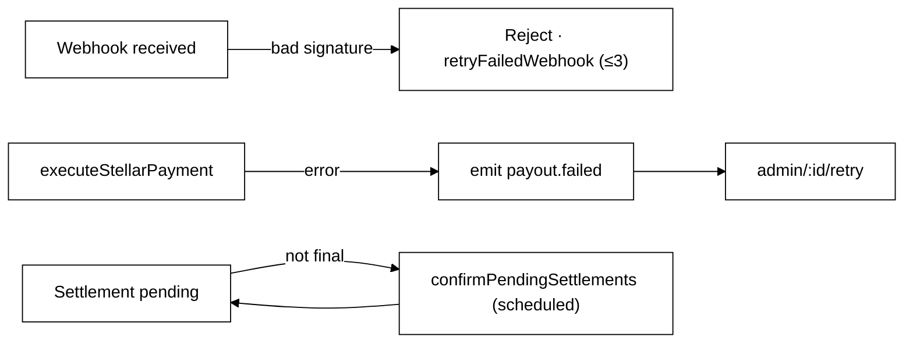
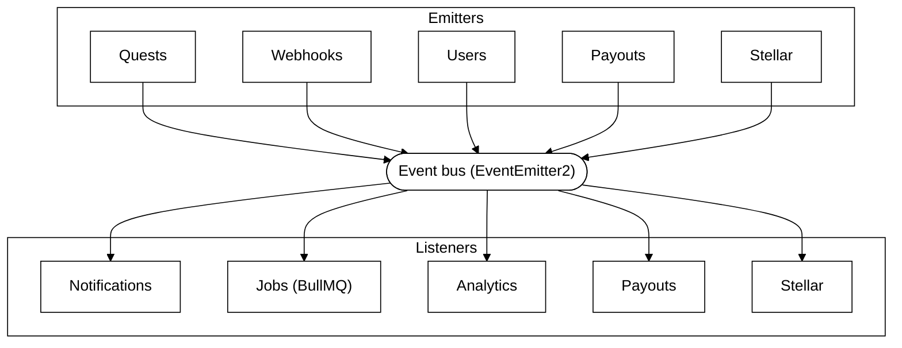
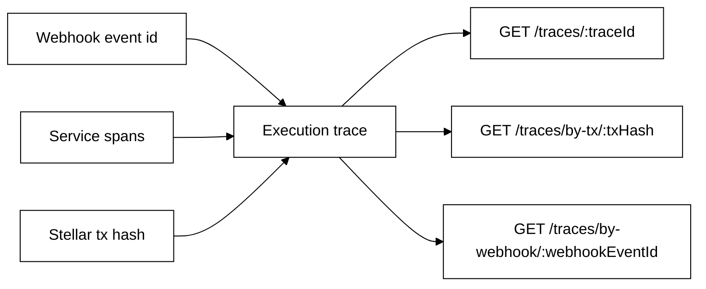

# Data Flow &amp; Diagrams
 
How a unit of work moves through the StellarEarn backend. All diagrams are [Mermaid](https://mermaid.js.org/) and render on GitHub as-is.
 
---
 
## 1. System context
 
Where the backend sits between the client, its datastores, and external services.
 

 
---
 
## 2. Request pipeline
 
Every HTTP request passes through the same cross-cutting layers before it reaches a controller, and through the filter chain on the way out. These are configured globally at bootstrap.
 

 
---
 
## 3. Quest lifecycle
 
The happy path from quest creation to a settled, on-chain reward. Note that submission creation and approval are driven by the **verification** path, and payout is reached through an **event**, not a direct call.
 

 
### Failure &amp; retry
 

 
---
 
## 4. Event-driven backbone
 
Modules stay decoupled by talking through the event bus (`@nestjs/event-emitter`) instead of importing each other — this is what broke the original circular dependencies (see `BackEnd/CIRCULAR_DEPENDENCY_RESOLUTION.md`). Emitters and listeners below reflect the modules that actually use the bus.
 

 
Representative flows on the bus: `quest.*` → Notifications/Analytics · `submission.approved` → Payouts · `payout.failed` → alerting/retry · user data-export request → Jobs queue (keeps the request thread free).
 
---
 
## 5. Trace correlation
 
Because work crosses module boundaries asynchronously, the Trace module lets you reassemble one logical operation from its parts. A trace can be fetched by id, by the Stellar **transaction hash**, or by the **webhook event** that started it.
 

 
This pairs with OpenTelemetry: the global `TraceInterceptor` opens a span per request, and the Trace endpoints expose the stored correlation for debugging the verification → payout pipeline.
 
---
 
## Keeping these diagrams honest
 
- Endpoint paths and module relationships here are derived from the controllers and services in `BackEnd/src/modules`. When routes change, update [the module reference](./module-apis.md) and any affected diagram in the same PR.
- For exact payloads and the complete current route list, the running Swagger UI at `/api/docs` is authoritative.
 